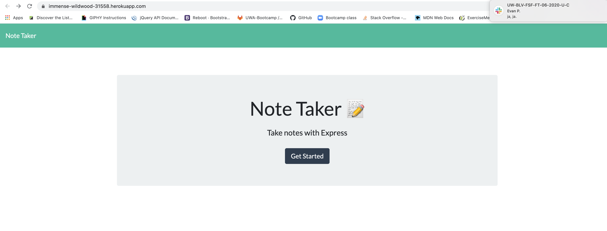

Github URL: https://github.com/mlshenk/note-taker

Heroku URL: https://immense-wildwood-31558.herokuapp.com/

This assignment asked us to create a note-taking application using an express server. When the user enters this webpage, they would click the black button, "Get Started", which will take them to a page where they can enter a note and add a title to it. They will also be able to save their note and delete it in the future. The server should also save the user's note when they refresh the page. This assignment used GET, POST, and DELETE funcions to retain the notes. This assignment was also a bit different in that we deployed it on Heroku so the user could access the page and server we created.
This assignement was admittedly very tricky and using Heroku for the first time lead to some interesting challenges to overcome.

